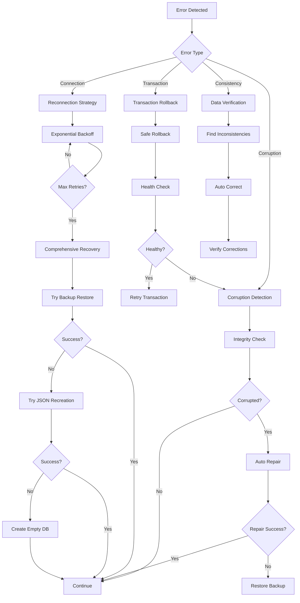

# Advanced Error Handling and Recovery System

This document describes the comprehensive error handling and recovery system implemented for the LightDB migration project.

## Overview

The error recovery system provides robust handling of database errors, automatic recovery strategies, and comprehensive monitoring to ensure database reliability and consistency.

## Components

### 1. ErrorRecoveryManager

The main component that handles various recovery strategies.

#### Features:

- **Automatic Reconnection**: Exponential backoff retry strategy
- **Corruption Detection**: SQLite integrity checks and automatic repair
- **Data Consistency Verification**: Detects and corrects data inconsistencies
- **Comprehensive Recovery**: Multi-step recovery process

#### Usage:

```typescript
import { ErrorRecoveryManager } from './services/error-recovery-manager'

const recoveryManager = new ErrorRecoveryManager(config, {
  maxRetries: 3,
  retryDelay: 1000,
  backoffMultiplier: 2,
  enableAutoRepair: true,
  enableCorruptionDetection: true
})

// Attempt reconnection with exponential backoff
const result = await recoveryManager.attemptReconnection(() => connectToDatabase())

// Detect and repair corruption
const corruptionResult = await recoveryManager.detectAndRepairCorruption(db)

// Verify and correct data inconsistencies
const consistencyResult = await recoveryManager.verifyAndCorrectInconsistencies(db)
```

### 2. TransactionManager

Handles database transactions with automatic rollback and recovery.

#### Features:

- **Automatic Rollback**: Safe transaction rollback on errors
- **Retry Logic**: Configurable retry attempts with delays
- **Savepoints**: Nested transaction support with savepoints
- **Batch Operations**: Execute multiple operations in a single transaction
- **Recovery Integration**: Automatic recovery on transaction failures

#### Usage:

```typescript
import { TransactionManager } from './services/transaction-manager'

const transactionManager = new TransactionManager(db, recoveryManager)

// Simple transaction
const result = await transactionManager.executeTransaction(async (db) => {
  db.prepare('INSERT INTO users (id, name) VALUES (?, ?)').run('1', 'John')
  return 'success'
})

// Batch operations
const batchResult = await transactionManager.executeBatch([
  (db) => db.prepare('INSERT INTO users (id, name) VALUES (?, ?)').run('2', 'Jane'),
  (db) => db.prepare('INSERT INTO users (id, name) VALUES (?, ?)').run('3', 'Bob')
])

// Nested transactions with savepoints
const nestedResult = await transactionManager.executeNestedTransaction([
  {
    name: 'savepoint1',
    operation: (db) => db.prepare('INSERT INTO users (id, name) VALUES (?, ?)').run('4', 'Alice'),
    onError: 'rollback'
  },
  {
    name: 'savepoint2',
    operation: (db) => db.prepare('INSERT INTO users (id, name) VALUES (?, ?)').run('5', 'Charlie'),
    onError: 'continue'
  }
])
```

### 3. DatabaseHealthMonitor

Continuous monitoring of database health with automatic recovery.

#### Features:

- **Health Checks**: Regular database health assessments
- **Performance Monitoring**: Response time and error rate tracking
- **Trend Analysis**: Health trends over time
- **Event System**: Health status change notifications
- **Auto-Recovery**: Automatic recovery on critical issues

#### Usage:

```typescript
import { DatabaseHealthMonitor } from './services/database-health-monitor'

const healthMonitor = new DatabaseHealthMonitor(db, recoveryManager, {
  checkInterval: 30000, // 30 seconds
  enableContinuousMonitoring: true,
  performanceThresholds: {
    responseTimeWarning: 1000,
    responseTimeCritical: 5000,
    errorRateWarning: 0.05,
    errorRateCritical: 0.1
  },
  autoRecovery: true
})

// Start monitoring
healthMonitor.startMonitoring()

// Event handling
healthMonitor.on('health-degraded', (result) => {
  console.warn('Database health degraded:', result.issues)
})

healthMonitor.on('auto-recovery-success', ({ issue, recoveryResult }) => {
  console.log('Auto-recovery successful:', recoveryResult.details)
})

// Manual health check
const healthResult = await healthMonitor.performHealthCheck()
console.log('Health status:', healthResult.healthy)

// Get health trends
const trends = healthMonitor.getHealthTrends()
console.log('Average response time:', trends.averageResponseTime)
```

## Integration with DatabaseManager

The DatabaseManager has been enhanced to integrate all error recovery components:

```typescript
import { DatabaseManager } from './services/database-manager'

const dbManager = new DatabaseManager(config, {
  maxRetries: 3,
  enableAutoRepair: true,
  enableCorruptionDetection: true
})

await dbManager.initialize()

// Access integrated components
const db = dbManager.getDatabase()
const transactionManager = dbManager.getTransactionManager()
const healthMonitor = dbManager.getHealthMonitor()
const recoveryManager = dbManager.getRecoveryManager()
```

## Error Recovery Strategies

### 1. Connection Failures

- **Strategy**: Exponential backoff retry
- **Steps**:
  1. Immediate retry
  2. Wait with exponential backoff
  3. Retry up to maximum attempts
  4. If all fail, attempt comprehensive recovery

### 2. Database Corruption

- **Detection**: SQLite PRAGMA integrity_check and quick_check
- **Repair**:
  1. REINDEX command
  2. VACUUM command
  3. Verify repair success
  4. If repair fails, restore from backup

### 3. Transaction Failures

- **Strategy**: Automatic rollback with retry
- **Steps**:
  1. Immediate rollback
  2. Check database health
  3. Retry transaction if database is healthy
  4. If repeated failures, trigger recovery

### 4. Data Inconsistencies

- **Detection**:
  - Orphaned records (foreign key violations)
  - Duplicate unique constraints
  - Invalid data formats
  - Missing timestamps
- **Correction**:
  - Clean orphaned records
  - Resolve duplicates (keep oldest)
  - Fix or remove invalid records
  - Update missing timestamps

## Recovery Process Flow



## Configuration Options

### ErrorRecoveryManager Options

```typescript
interface RecoveryOptions {
  maxRetries: number // Maximum retry attempts (default: 3)
  retryDelay: number // Initial delay between retries (default: 1000ms)
  backoffMultiplier: number // Exponential backoff multiplier (default: 2)
  enableAutoRepair: boolean // Enable automatic corruption repair (default: true)
  enableCorruptionDetection: boolean // Enable corruption detection (default: true)
}
```

### TransactionManager Options

```typescript
interface TransactionOptions {
  timeout: number // Transaction timeout (default: 30000ms)
  retryAttempts: number // Retry attempts (default: 3)
  enableAutoRollback: boolean // Enable automatic rollback (default: true)
  enableRecovery: boolean // Enable recovery on failure (default: true)
}
```

### DatabaseHealthMonitor Options

```typescript
interface MonitorOptions {
  checkInterval: number // Health check interval (default: 30000ms)
  enableContinuousMonitoring: boolean // Enable continuous monitoring (default: true)
  performanceThresholds: {
    responseTimeWarning: number // Warning threshold (default: 1000ms)
    responseTimeCritical: number // Critical threshold (default: 5000ms)
    errorRateWarning: number // Warning error rate (default: 0.05)
    errorRateCritical: number // Critical error rate (default: 0.1)
  }
  autoRecovery: boolean // Enable automatic recovery (default: true)
}
```

## Events and Monitoring

### Health Monitor Events

- `monitoring-started`: Monitoring has started
- `monitoring-stopped`: Monitoring has stopped
- `health-ok`: Health check passed
- `health-degraded`: Health issues detected
- `health-check-failed`: Health check failed
- `auto-recovery-success`: Automatic recovery succeeded
- `auto-recovery-failed`: Automatic recovery failed
- `auto-recovery-error`: Error during recovery attempt

### Health Metrics

```typescript
interface HealthMetrics {
  timestamp: Date
  connectionStatus: 'healthy' | 'degraded' | 'failed'
  responseTime: number
  errorCount: number
  warningCount: number
  lastError?: Error
  databaseSize: number
  activeConnections: number
  corruptionDetected: boolean
}
```

## Best Practices

### 1. Configuration

- Set appropriate retry limits to avoid infinite loops
- Configure reasonable timeouts for your use case
- Enable auto-repair for production environments
- Use continuous monitoring for critical applications

### 2. Error Handling

- Always check transaction results before proceeding
- Log recovery attempts for debugging
- Monitor health trends to identify patterns
- Set up alerts for critical health issues

### 3. Performance

- Adjust health check intervals based on system load
- Use batch operations for multiple related changes
- Monitor response time trends
- Optimize queries to reduce error rates

### 4. Recovery

- Maintain regular backups for recovery scenarios
- Test recovery procedures regularly
- Document custom recovery strategies
- Monitor recovery success rates

## Testing

The error recovery system includes comprehensive tests:

```bash
# Run error recovery tests
npx tsx src/main/test-error-recovery-simple.ts
```

Test coverage includes:

- Reconnection strategies with various failure scenarios
- Corruption detection and repair
- Transaction rollback and retry
- Health monitoring and event handling
- Comprehensive recovery scenarios

## Troubleshooting

### Common Issues

1. **Repeated Connection Failures**
   - Check database file permissions
   - Verify database path exists
   - Check for file system issues

2. **Transaction Rollback Errors**
   - Ensure proper transaction nesting
   - Check for concurrent access issues
   - Verify database is not corrupted

3. **Health Check Failures**
   - Check database accessibility
   - Verify table existence
   - Monitor system resources

4. **Recovery Failures**
   - Check backup file availability
   - Verify JSON source data
   - Check file system permissions

### Debugging

Enable detailed logging by setting appropriate log levels:

```typescript
// Enable detailed error logging
console.log('Error recovery debug mode enabled')
```

Monitor health metrics and trends to identify issues early:

```typescript
const trends = healthMonitor.getHealthTrends()
if (trends.responseTime > 1000) {
  console.warn('Response time degrading:', trends)
}
```

## Conclusion

The advanced error handling and recovery system provides comprehensive protection against database failures, ensuring data integrity and system reliability. The modular design allows for easy customization and extension based on specific requirements.
